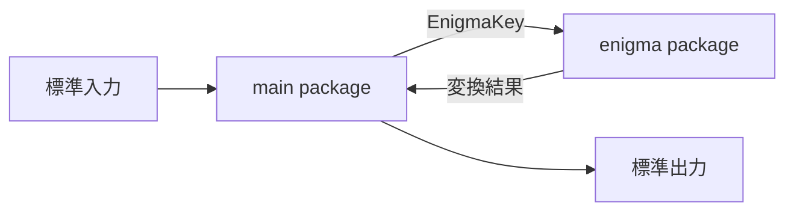

# アーキテクチャ

## 全体構成図

## 技術選定と理由（ADR）

### ADR-001: Go言語での実装

- 決定: Go言語で実装する。
- 背景: Go言語の学習そのものが本プロジェクトの目的（`README.md`）。
- 却下した選択肢: なし（言語選定自体が目的のため、他言語は検討していない）。
- トレードオフ: なし。

## レイヤー構成と依存の方向

- `main` → `enigma` の一方向依存。`main` パッケージは標準ライブラリの `bufio`, `fmt`, `os`, `strings` を、`enigma` パッケージは `strings` のみを使用する。両パッケージとも外部モジュールへの依存はゼロ（`go.mod` より）。
- `main` は `enigma` の公開API（`EnigmaKey`, `NewEnigmaFromKey`, `Encrypt`）のみを利用する。`Rotor` / `Reflector` / `Plugboard` の内部フィールドはすべて非公開で、`enigma` パッケージ外から直接触れない。

## 不変条件・境界

- ローターのノッチ判定（`Rotor.AtNotch()`）は、ローターの現在位置そのものと `notch` を比較する。`wiring`（配線テーブル）を経由して判定してはならない。ノッチは回転位置を検知する機械的な仕組みであり、`wiring` は電気信号の文字置換という別レイヤーの仕組みのため。過去にこの2つを混同し、ダブルステッピング挙動が壊れる事故が発生している（`AGENTS.md` の Incidents、および `df38a83` を参照）。
- 右（高速）ローターは、`Enigma.stepRotors()` において毎打鍵・無条件に回転しなければならない。ダブルステップが発生する打鍵（中央ローターが自身のノッチにある打鍵）であっても例外ではない。過去にこの回転処理が丸ごとスキップされる事故が発生している（`AGENTS.md` の Incidents、および `35dab1a` を参照）。

## 共通規約

TBD — 命名規則・ログ出力方針などは明示的に定めていない。

## 非機能の実現方式

- テスト方針: 標準ライブラリの `testing` パッケージによるユニットテストのみ（追加の外部テストライブラリは導入しない）。`src/enigma` 配下に、コンポーネントごと（`Rotor`, `Reflector`, `Plugboard`）の単体テストと、既知のエニグマ参照テストベクター（rotors III/II/I, ring 1/1/1, 位置`AAA`, リフレクターB, プラグボードなしで`"AAAAA"`→`"BDZGO"`）による回帰テストを置く。`cd src && go test ./...` で実行する。
- カバレッジ基準・CI導入: 特に定めない（個人学習用リポジトリのため）。
