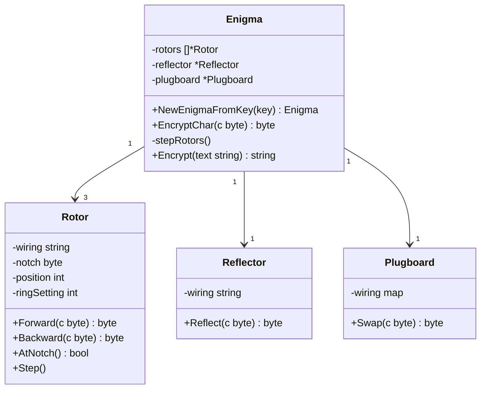
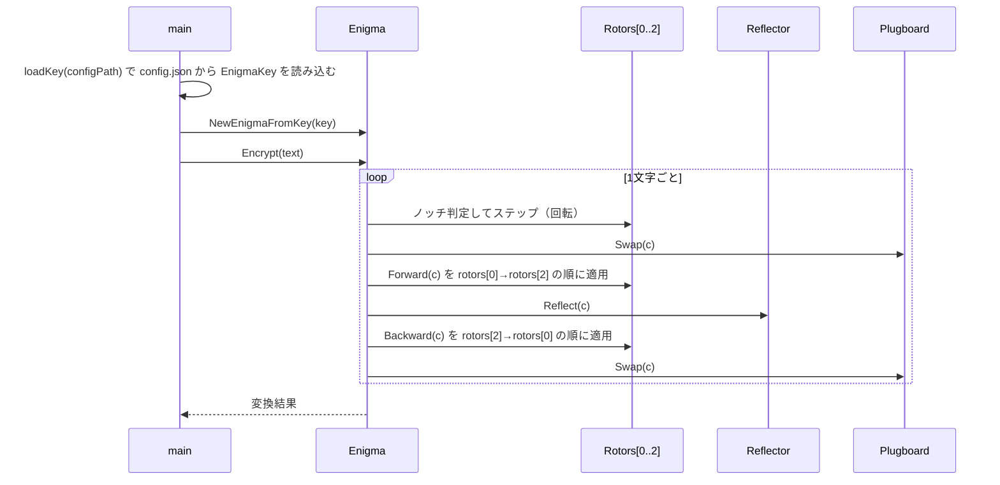

# 詳細設計

## モジュール・クラス構成

```mermaid
classDiagram
    class Enigma {
        -rotors []*Rotor
        -reflector *Reflector
        -plugboard *Plugboard
        +NewEnigmaFromKey(key) Enigma
        +EncryptChar(c byte) byte
        -stepRotors()
        +Encrypt(text string) string
    }
    class Rotor {
        -wiring string
        -notch byte
        -position int
        -ringSetting int
        +Forward(c byte) byte
        +Backward(c byte) byte
        +AtNotch() bool
        +Step()
    }
    class Reflector {
        -wiring string
        +Reflect(c byte) byte
    }
    class Plugboard {
        -wiring map
        +Swap(c byte) byte
    }
    Enigma "1" --> "3" Rotor
    Enigma "1" --> "1" Reflector
    Enigma "1" --> "1" Plugboard
```

## 主要な処理の流れ

```mermaid
sequenceDiagram
    participant Main as main
    participant E as Enigma
    participant Rot as Rotors[0..2]
    participant Ref as Reflector
    participant PB as Plugboard

    Main->>Main: loadKey(configPath) で config.json から EnigmaKey を読み込む
    Main->>E: NewEnigmaFromKey(key)
    Main->>E: Encrypt(text)
    loop 1文字ごと
        E->>Rot: ノッチ判定してステップ（回転）
        E->>PB: Swap(c)
        E->>Rot: Forward(c) を rotors[0]→rotors[2] の順に適用
        E->>Ref: Reflect(c)
        E->>Rot: Backward(c) を rotors[2]→rotors[0] の順に適用
        E->>PB: Swap(c)
    end
    E-->>Main: 変換結果
```

## データアクセス設計

N/A — 永続化なし。すべてインメモリで完結する。
